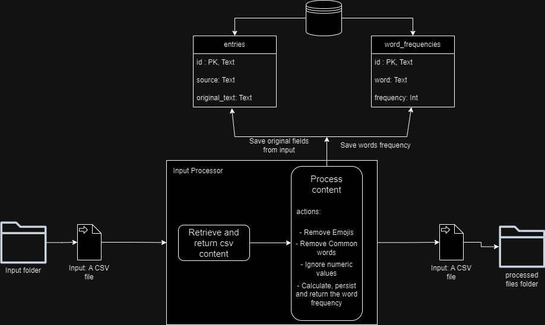

# Word Frequency Python Program
***
This program reads a CSV file containing its id, source and text content, persists the input and the words frequency following a certain acceptance criteria.
## Acceptance Criteria
***
- Reads a CSV (comma-separated values) file as the input from a folder.
- Performs a word frequency count on the text in the “original_text” segment (the third segment).
  - The count should ignore a predefined set of common words (e.g. “a”, “the”, “then”, “and”,
“an”, etc).
  - It should ignore numbers in numeric form within the text (e.g. “100”, “1.250”) but numbers
spelled out as words (e.g. “three”, “thousand”) is allowed and should be counted.
  - It should ignore emojis.
- The results should be stored in a database along with the original fields in the CSV file.
- The original file should be moved to another folder once processing is complete.

## Requirements and Constraints
***
- Use Python
- Your code should work and run - please provide instructions!
- There is no need for authN or authZ
- There is no need for deployment or infrastructure management, your solution just needs to run
locally for us when we receive it
- Please make your solution available publicly on a source code management system or supply as a
zipped file

## System Design
***
1. Main Application (main.py):
   - Entry point of the application
   - Orchestrates the overall process flow
   - Calls methods from other modules as needed

2. App Module (app/app.py):
   - Contains the core application logic
   - Manages the workflow of processing entries

3. Text Processor (app/processor/text_processor.py):
   - Reads CSV files from the input folder
   - Processes text to remove emojis, common words, and numbers
   - Calculates word frequency

4. Database Client (app/storage/database_client.py):
   - Manages database connections
   - Provides methods for database operations

5. Text Processor DAO (app/storage/text_processor_dao.py):
   - Data Access Object for handling database operations specific to text processing
   - Implements methods to save entries and word frequencies

6. Constants (app/utils/constants.py):
   - Stores constant values used across the application (e.g., common words to ignore)

7. File Management:
   - Handles moving processed files from 'entries' to 'processed' folder

### Process Flow
1. Main Application:
   - Initializes the App module

2. App Module:
   - Monitors the 'entries' folder for new CSV files
   - For each new file:
       1. Calls Text Processor to read and process the file
       2. Calls Text Processor DAO to save results in the database
       3. Moves the processed file to the 'processed' folder

3. Text Processor:
   - Reads CSV file
   - Extracts 'original_text' from CSV
   - Processes text (removes emojis, common words, numbers)
   - Calculates word frequency
   - Returns processed data

4. Text Processor DAO:
   - Receives processed data
   - Saves original entry data to 'entries' table
   - Saves word frequency data to 'words_frequency' table

5. File Management:
   - Moves the processed CSV file from 'entries' to 'processed' folder

### Database Schema
1. entries table:
   - id (primary key)
   - source_id (from CSV)
   - source (from CSV)
   - original_text (from CSV)
   - processed_date

2. words_frequency table:
   - entry_id (foreign key referencing entries table)
   - word
   - frequency

### Diagram

## Running The Program Locally
***

#### Requirements
- You need Python installed in your machine.

#### 1. Cloning The Repository
1. Scroll to the top of my repository and click on the "clone or download button"
  2. Decide whether you want to clone the project using HTTPS or an SSH key and do the following:
    * HTTPS: click on the checklist icon to the right of the URL
    * SSH key: first click on 'Use SSH' then click on the same icon as above
  3. Open the 'Terminal'
  4. Change the current working directory to the location where you want the cloned directory
  5. Type 'git clone', and then paste the URL you copied earlier.
  6. Press 'Enter' to create your local clone.

   You can find both the source of this information and learn more about the process on the following link: [Cloning a Repository](https://docs.github.com/en/github/creating-cloning-and-archiving-repositories/cloning-a-repository)

#### 2. Setup Virtual Environment
 - `python -m venv venv`
 - `source venv/bin/activate` Activate virtual environment (for Unix/Linux)
 - `venv\Scripts\activate` Activate virtual environment (for Windows)
 - `pip3 install -r requirements.txt` Install dependencies

#### 3. Run The Python Program
- From the root directory run the following command `python main.py`

## Testing
***
- Testing frameworks: `pytest` and `unittest`

#### 1. Running All Tests
- `coverage run -m pytest -v`

#### 2. Generate Coverage CLI Report
   - `coverage report`

#### 3. Generate Coverage HTML Report
- `coverage html`

#### 4. Opening the Coverage HTML Report in Your Browser
- windows: `cmd /c start "" htmlcov/index.html`
- Linux/macOS: `open htmlcov/index.html`